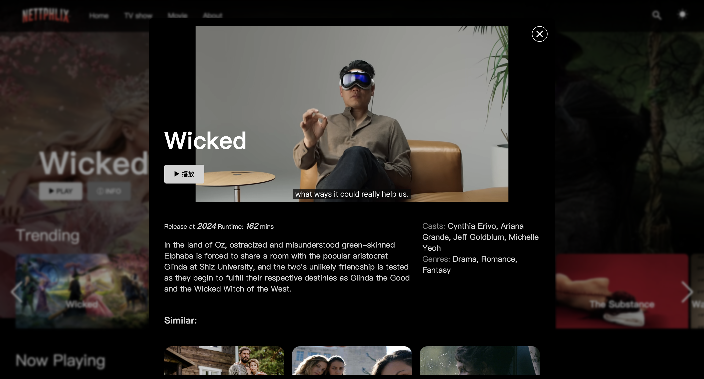

# Movie Web App 🎬

A sleek and modern web application built with **React** that allows users to browse, search, and explore movies using the **TMDB API**. This project incorporates key design patterns, including **Builder** and **Singleton**, to enhance scalability and maintainability.

---

## Features ✨

- **Search Movies**: Find your favorite movies quickly with a responsive search bar.
- **Movie Details**: View detailed information about each movie, including synopsis, ratings, and more.
- **Responsive Design**: Optimized for mobile, tablet, and desktop.
- **TMDB API Integration**: Fetch real-time movie data from [The Movie Database (TMDB)](https://www.themoviedb.org/documentation/api).

---

## Tech Stack 🛠️

- **Frontend Framework**: [React](https://reactjs.org/)
- **Styling**: SCSS
- **API**: [TMDB API](https://www.themoviedb.org/documentation/api)

---

## Design Patterns Used 🧩

### 1. Builder Pattern
Used to conveniently construct YoutubePlayer objects.

### 2. Singleton Pattern
Implemented to manage a single instance of the YoutubePlayer client, ensuring video play correctly.

---

## Setup Instructions 🚀

### Prerequisites
- Node.js and npm installed on your machine.

### Installation
1. Clone the repository:
   ```bash
   git clone <your-repo-url>
   cd vite-project
   ```
2. Install dependencies:
   ```bash
   npm install
   ```
   
3. Start the development server:
   ```bash
   npm run dev
   ```
   
4. Set up your TMDB API key:
   - Get your API key & Authorization from TMDB.
   - Create a .env file in the project root and add:
     ```
     VITE_TMDB_API_KEY=your_api_key_here
     VITE_TMDB_AUTHORIZATION=your_authorization_here
     ```

4. Open your browser and navigate to http://localhost:5174.

## Screenshots 📸!
### Homepage:

### Movie Details Page:


## Acknowledgments 🙌
- TMDB API for providing the movie data.
- Open-source tools and libraries that made this project possible.